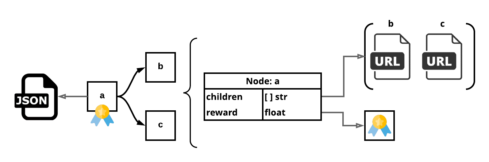
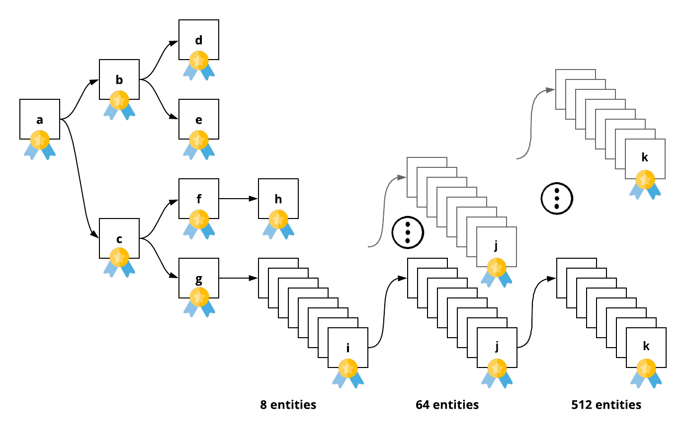

# algorithmia
Algorithmia Interview, 5th May 2018

## Introduction

### Invite

> Hi Jeffrey,

> It was great speaking with you, and I'm excited about exploring a fit
> with Algorithmia. We'd like to invite you to complete our technical take-home
> exercise at your earliest convenience. You can find it here: http://algo.work/interview

> Once you submit your solution to the marketplace, please click
> the link below and paste your link in the notes.

> Please let me know if you have any questions.

> Thanks!

> Chris Armstrong
> Director of Engineering
> Algorithmia

> Please submit here:
> https://app2.greenhouse.io/tests/613c9acbc43a2fb2e656adf65c8628ee


### Details: http://algo.work/interview

**Algorithmia Interview**

The purpose of this exercise is to give an opportunity to all candidates to work
through a realistic scenario as an engineer at Algorithmia. This is also an
opportunity to showcase your ability working in your most comfortable environment.
The goal here is to see how you approach engineering problems, your understanding
of tools and frameworks, and ability to prioritize and creatively solve problems.

One of the trickiest, and yet most common, challenges in programming comes
from dealing with parallelization and asynchronous code. We have a server
already set up with some API endpoints to query. An example starting point is:

GET http://algo.work/interview/a
Each endpoint returns JSON of the form:

```json
{
  "children": [
    "http:\/\/algo.work\/interview\/b",
    "http:\/\/algo.work\/interview\/c"
  ],
  "reward": 1
}
```

+ Your challenge is to write an algorithm on the Algorithmia platform, in the language of your choice,
that traverses the entire tree of API endpoints and returns the sum total rewards.
+ The input to the algorithm will be a starting url, such as "http://algo.work/interview/a".
+ For each page listed in the "children" field, you are to make a request to the given endpoint and
recursively follow down the tree until you have explored all descendants of the starting page.
+ As you visit each page, add up the "reward" fields of the whole tree.
+ Your algorithm should return this sum as its result.

**Notes:**

+ Some of the endpoints take time to perform their job.
+ You should implement your algorithm in a way that explores the tree in as short a time as possible.
+ When creating your algorithm, be sure to make it closed source.
+ When publishing it, set the visibility to private.
+ Please take your time to implement a sound and efficient solution.
+ Once you're happy with your implementation, send us a link for review.


## Initial Review: Checkout Endpoint

### Approach

To checkout interview endpoint http://algo.work/interview, the simplest
and fastest is to use available tools locally command-terminal.

I work on a macOS laptop, so what is default is different from other Unix
environments, and it has its own utilities for environment and tools installation, brew.

### Recommended Tools Setup

The following setup is assuming the reader is developing on macOS.

#### Brew install jq
`jq` is a lightweight and flexible command-line JSON processor.
Reference: https://stedolan.github.io/jq/

By default, macOS does not come with `jq`.

Install `jq` using `Homebrew`:
```bash
brew install jq
```

#### Brew install Bash 4
Reference: http://wiki.bash-hackers.org/bash4

By default, macOS does not come with the most current `bash`.

Install latest `bash` using `Homebrew`:
```bash
$ brew update
$ brew install bash
$ sudo chown -R `whoami` /usr/local
$ brew link --overwrite bash
$ brew upgrade bash
```

### Curl checkout of Algorithmia interview endpoint

Created a simple bash script using both `curl` and `jq` to explore Algorithmia interview endpoint:

```
scripts
├── algo_work_interview.sh
└── sources
    └── curl_algo_work_interview.sh
```

#### Bash `algo_work_interview.sh`

```bash
./algo_work_interview.sh --help

Usage: ./algo_work_interview.sh
 [-v|--verbose]
 [-h|--help]
 [--endpoint <string>, default: 'a']
```

```bash
./algo_work_interview.sh
```

```json
{
  "children": [
    "http://algo.work/interview/b",
    "http://algo.work/interview/c"
  ],
  "reward": 1
}
0.197475
```

```bash
./algo_work_interview.sh --endpoint c
```

```json
{
  "children": [
    "http://algo.work/interview/f",
    "http://algo.work/interview/g"
  ],
  "reward": 3
}
1.070582
```

#### Walk The Tree

`fmt_endpoint`: `str`: `http://algo.work/interview/ENDPOINT`

+ Request Endpoint: `fmt_endpoint`
+ Response Endpoints: `array` `fmt_endpoint` (bag, not unique, expect duplicates): `"children"`
+ Reward: `float`
  + Expect negative values: `"reward"`
  + Returned value is consistent with requested `fmt_endpoint` if asked multiple times.
+ Processing Time: `time_total` provided by `curl`
  + Reference: https://blog.josephscott.org/2011/10/14/timing-details-with-curl/
  + Processing time is consistent with requested `fmt_endpoint` if asked multiple times.


| Request Endpoint  | Processing Time  | Response Endpoints       | Reward | Calls | Total Rewards |
|-------------------|------------------|--------------------------|--------|-------|---------------|
| a                 | 0.197475         | b, c                     | 1      |  2    |  1            |
| b                 | 6.734861         | d, e                     | 2      |  2    |  3            |
| c                 | 1.070582         | f, g                     | 3      |  2    |  6            |
| d                 | 0.394293         | NULL                     | 4      |  0    |  10           |
| e                 | 0.938208         | NULL                     | 5      |  0    |  15           |
| f                 | 1.338257         | h                        | 6      |  1    |  21           |
| g                 | 2.137113         | i (8)                    | 7      |  8    |  28           |
| h                 | 0.195248         | NULL                     | -1     |  0    |  27           |
| i                 | 0.256074         | j (8)                    | 0      |  64   |  27           |
| j                 | 0.203789         | k (8)                    | 0      |  512  |  27           |
| k                 | 0.194828         | NULL                     | 0.25   |  0    |  155          |


| Name                   | Value |
|------------------------|-------|
| Total Expected Calls   | 592   |
| Total Expected Rewards | 155   |


#### Observations

Either this is a early shallow tree, or I am missing something:





## Python Coding: Worker Factory

Resolved problem without Algorithmia libraries and created my own Worker Thread Class based upon Requests, https://pypi.org/project/requests/:
+ https://pypi.org/project/logging-fortified/
+ https://pypi.org/project/requests-fortified/
+ https://pypi.org/project/requests-worker/

```bash
$ cd py_algo_worker
$ make local-run
======================================================
clean:
======================================================
======================================================
install
======================================================
======================================================
local-run
======================================================
{"asctime": "2018-05-05 22:55:17 -0700", "levelname": "INFO", "name": "requests_worker", "version": "0.0.1", "message": "Example Worker: Starting"}
{"asctime": "2018-05-05 22:55:17 -0700", "levelname": "INFO", "name": "requests_worker", "version": "0.0.1", "message": "Run: Starting"}
{"asctime": "2018-05-05 22:55:17 -0700", "levelname": "INFO", "name": "requests_worker", "version": "0.0.1", "message": "Worker: Start"}
{"asctime": "2018-05-05 23:55:06 -0700", "levelname": "INFO", "name": "requests_fortified", "version": "0.2.0", "message": "request_url 'http://algo.work/interview/a': Request: Finished", "request_time_msecs": 229}
{"asctime": "2018-05-05 23:55:07 -0700", "levelname": "INFO", "name": "requests_fortified", "version": "0.2.0", "message": "request_url 'http://algo.work/interview/c': Request: Finished", "request_time_msecs": 1303}
{"asctime": "2018-05-05 23:55:08 -0700", "levelname": "INFO", "name": "requests_fortified", "version": "0.2.0", "message": "request_url 'http://algo.work/interview/f': Request: Finished", "request_time_msecs": 1226}
{"asctime": "2018-05-05 23:55:13 -0700", "levelname": "INFO", "name": "requests_fortified", "version": "0.2.0", "message": "request_url 'http://algo.work/interview/b': Request: Finished", "request_time_msecs": 6633}
{"asctime": "2018-05-05 23:55:13 -0700", "levelname": "INFO", "name": "requests_fortified", "version": "0.2.0", "message": "request_url 'http://algo.work/interview/h': Request: Finished", "request_time_msecs": 96}
{"asctime": "2018-05-05 23:55:13 -0700", "levelname": "INFO", "name": "requests_fortified", "version": "0.2.0", "message": "request_url 'http://algo.work/interview/d': Request: Finished", "request_time_msecs": 390}
{"asctime": "2018-05-05 23:55:13 -0700", "levelname": "INFO", "name": "requests_fortified", "version": "0.2.0", "message": "request_url 'http://algo.work/interview/e': Request: Finished", "request_time_msecs": 812}
{"asctime": "2018-05-05 23:55:14 -0700", "levelname": "INFO", "name": "requests_fortified", "version": "0.2.0", "message": "request_url 'http://algo.work/interview/g': Request: Finished", "request_time_msecs": 1693}
***
{"asctime": "2018-05-05 22:56:26 -0700", "levelname": "INFO", "name": "requests_fortified", "version": "0.2.0", "message": "request_url 'http://algo.work/interview/k': Request: Finished", "request_time_msecs": 91}
{"asctime": "2018-05-05 22:56:26 -0700", "levelname": "INFO", "name": "requests_fortified", "version": "0.2.0", "message": "request_url 'http://algo.work/interview/k': Request: Finished", "request_time_msecs": 92}
{"asctime": "2018-05-05 22:56:26 -0700", "levelname": "INFO", "name": "requests_fortified", "version": "0.2.0", "message": "request_url 'http://algo.work/interview/k': Request: Finished", "request_time_msecs": 91}
{"asctime": "2018-05-05 22:56:26 -0700", "levelname": "INFO", "name": "requests_fortified", "version": "0.2.0", "message": "request_url 'http://algo.work/interview/k': Request: Finished", "request_time_msecs": 93}
{"asctime": "2018-05-05 22:56:26 -0700", "levelname": "INFO", "name": "requests_fortified", "version": "0.2.0", "message": "request_url 'http://algo.work/interview/k': Request: Finished", "request_time_msecs": 93}
{"asctime": "2018-05-05 23:55:20 -0700", "levelname": "INFO", "name": "Example Worker", "version": "0.0.1", "message": "TOTAL REWARD: 155.0"}
{"asctime": "2018-05-05 23:55:20 -0700", "levelname": "INFO", "name": "Example Worker", "version": "0.0.1", "message": "TOTAL CALLS: 592"}
{"asctime": "2018-05-05 23:55:20 -0700", "levelname": "INFO", "name": "requests_worker", "version": "0.0.1", "message": "Worker: Finish"}
{"asctime": "2018-05-05 23:55:20 -0700", "levelname": "INFO", "name": "requests_worker", "version": "0.0.1", "message": "Run: Completed", "exit_code": 0, "exit_desc": "Successfully completed", "exit_name": "Success", "run_time_msec": 14712}
{"asctime": "2018-05-05 23:55:20 -0700", "levelname": "INFO", "name": "requests_worker", "version": "0.0.1", "message": "Example Worker: Success", "exit_code": 0, "exit_desc": "Successfully completed", "exit_name": "Success", "run_time_msec": 14712}
{"asctime": "2018-05-05 23:55:20 -0700", "levelname": "INFO", "name": "requests_worker.worker_factory", "version": "0.0.1", "message": "Completed: Success", "exit_code": 0, "exit_desc": "Successfully completed", "exit_name": "Success", "run_time_msec": 14712}
{"asctime": "2018-05-05 23:55:20 -0700", "levelname": "INFO", "name": "requests_worker.worker_factory", "version": "0.0.1", "message": "Finished", "Exit Code": 0}
```

| Name                | Value      |
|---------------------|------------|
| Total Calls         | 592        |
| Total Rewards       | 155        |
| Without Parallelism | 69111 msec |
| With Parallelism    | 14712 msec |


## Python Coding: Worker Algorithm


```bash
$ cd py_algo_client
$ make local-run
======================================================
clean:
======================================================
======================================================
install
======================================================
======================================================
local-run
======================================================
{"asctime": "2018-05-06 01:05:23 -0700", "levelname": "INFO", "name": "requests_fortified", "version": "0.2.0", "message": "request_url 'http://algo.work/interview/a': Request: Finished", "request_time_msecs": 236}
{"asctime": "2018-05-06 01:05:24 -0700", "levelname": "INFO", "name": "requests_fortified", "version": "0.2.0", "message": "request_url 'http://algo.work/interview/c': Request: Finished", "request_time_msecs": 1222}
{"asctime": "2018-05-06 01:05:26 -0700", "levelname": "INFO", "name": "requests_fortified", "version": "0.2.0", "message": "request_url 'http://algo.work/interview/f': Request: Finished", "request_time_msecs": 1227}
{"asctime": "2018-05-06 01:05:30 -0700", "levelname": "INFO", "name": "requests_fortified", "version": "0.2.0", "message": "request_url 'http://algo.work/interview/b': Request: Finished", "request_time_msecs": 6549}
{"asctime": "2018-05-06 01:05:30 -0700", "levelname": "INFO", "name": "requests_fortified", "version": "0.2.0", "message": "request_url 'http://algo.work/interview/h': Request: Finished", "request_time_msecs": 101}
{"asctime": "2018-05-06 01:05:30 -0700", "levelname": "INFO", "name": "requests_fortified", "version": "0.2.0", "message": "request_url 'http://algo.work/interview/d': Request: Finished", "request_time_msecs": 395}
{"asctime": "2018-05-06 01:05:30 -0700", "levelname": "INFO", "name": "requests_fortified", "version": "0.2.0", "message": "request_url 'http://algo.work/interview/e': Request: Finished", "request_time_msecs": 591}
{"asctime": "2018-05-06 01:05:31 -0700", "levelname": "INFO", "name": "requests_fortified", "version": "0.2.0", "message": "request_url 'http://algo.work/interview/g': Request: Finished", "request_time_msecs": 1695}
{"asctime": "2018-05-06 01:05:32 -0700", "levelname": "INFO", "name": "requests_fortified", "version": "0.2.0", "message": "request_url 'http://algo.work/interview/i': Request: Finished", "request_time_msecs": 107}
***
{"asctime": "2018-05-06 01:05:37 -0700", "levelname": "INFO", "name": "requests_fortified", "version": "0.2.0", "message": "request_url 'http://algo.work/interview/k': Request: Finished", "request_time_msecs": 94}
{"asctime": "2018-05-06 01:05:37 -0700", "levelname": "INFO", "name": "requests_fortified", "version": "0.2.0", "message": "request_url 'http://algo.work/interview/k': Request: Finished", "request_time_msecs": 91}
{"asctime": "2018-05-06 01:05:37 -0700", "levelname": "INFO", "name": "requests_fortified", "version": "0.2.0", "message": "request_url 'http://algo.work/interview/k': Request: Finished", "request_time_msecs": 97}
{"asctime": "2018-05-06 01:05:37 -0700", "levelname": "INFO", "name": "Algo Rewards", "version": "0.0.1", "message": "TOTAL REWARD: 155.0"}
{"asctime": "2018-05-06 01:05:37 -0700", "levelname": "INFO", "name": "Algo Rewards", "version": "0.0.1", "message": "TOTAL CALLS: 592"}
```
